# 🌊 Ripple

**Ripple** 是一个将 Notion 中的笔记内容结构化处理后，自动分发至多个平台（如社交媒体、博客、微信公众号等）的内容自动化分发工具。你写下的是想法，它扩散的是影响力。

---

## ✨ Features

- 📝 **支持 Notion 输入**：通过 API 同步 Notion 笔记
- 🔍 **内容处理**：
  - 标题优化
  - 摘要生成
  - 标签提取
  - 多平台模板渲染
- 📣 **一键多平台分发**：
  - [x] 微信公众号（WeChat Official Account）
  - [x] al-folio Blog 平台
  - [x] Substack（自动创建草稿）
  - [ ] Twitter / X
  - [ ] 小红书（可导出待发布内容）
  - [ ] Hugo、Ghost、Notion Blog
  - [ ] 邮件（Mailchimp）
- 🤖 **AI 助力**（可选）：自动润色、拆分为多条内容、智能摘要

---

## 📦 Architecture

```mermaid
graph TD
  A[Notion 笔记] --> B[内容抓取器]
  B --> C[内容解析与结构化]
  C --> D[多平台模板渲染]
  D --> E[分发模块]
  E --> F1[✅ 微信公众号]
  E --> F2[✅ al-folio Blog]
  E --> F3[✅ Substack]
  E --> F4[⏳ Twitter/X]
  E --> F5[⏳ 小红书]
  E --> F6[⏳ 其他平台]

  classDef notionClass fill:#f9f,stroke:#333,stroke-width:2px
  classDef processingClass fill:#bbf,stroke:#333,stroke-width:2px
  classDef supportedClass fill:#9f9,stroke:#333,stroke-width:2px
  classDef plannedClass fill:#ffa,stroke:#333,stroke-width:2px
  
  class A notionClass
  class B,C,D,E processingClass
  class F1,F2,F3 supportedClass
  class F4,F5,F6 plannedClass
```



---

## 🚀 Quick Start

### 1. 配置环境变量

复制 `.env.example` 到 `.env` 并填入相关配置：

```bash
cp .env.example .env
```

### 2. 配置 Notion 集成

1. 创建 Notion 集成：[https://www.notion.so/my-integrations](https://www.notion.so/my-integrations)
2. 获取 Integration Token
3. 在 Notion 数据库中添加集成权限
4. 复制数据库 ID

### 3. 配置分发平台

#### Substack 配置

1. 登录 Substack 网站
2. 打开浏览器开发者工具 (F12)
3. 找到请求头中的 Cookie 值
4. 配置环境变量：

```bash
SUBSTACK_ENABLED=true
SUBSTACK_DOMAIN=your-newsletter.substack.com
SUBSTACK_COOKIE=your-cookie-value
```

#### 其他平台配置

- **微信公众号**: 需要配置 AppID 和 AppSecret
- **al-folio Blog**: 需要配置 GitHub Token 和仓库信息

### 4. 启动服务

```bash
# 安装依赖
make install

# 启动服务
make run
```

---

## 📚 API 使用

### 同步 Notion 页面

```bash
curl -X POST http://localhost:5334/api/v1/notion/sync
```

### 发布到所有平台

```bash
curl -X POST http://localhost:5334/api/v1/publisher/publish/{pageId}
```

### 发布到 Substack

```bash
# 创建草稿
curl -X POST http://localhost:5334/api/v1/publisher/draft/{pageId}/substack

# 发布到 Substack
curl -X POST http://localhost:5334/api/v1/publisher/publish/{pageId}/substack
```

### 查看发布历史

```bash
curl -X GET http://localhost:5334/api/v1/publisher/history/{pageId}
```

---

## 🔧 Configuration

完整的配置文件位于 `configs/server.yaml`：

```yaml
server:
  host: "${HOST:localhost}"
  port: ${PORT:5334}
  mode: "${GIN_MODE:debug}"

database:
  host: "${DB_HOST:localhost}"
  port: ${DB_PORT:5432}
  username: "${DB_USERNAME:postgres}"
  password: "${DB_PASSWORD:postgres}"
  database: "${DB_DATABASE:ripple}"

notion:
  token: "${NOTION_TOKEN:}"
  database_id: "${NOTION_DATABASE_ID:}"

publisher:
  substack:
    enabled: ${SUBSTACK_ENABLED:false}
    domain: "${SUBSTACK_DOMAIN:}"
    cookie: "${SUBSTACK_COOKIE:}"
    auto_publish: ${SUBSTACK_AUTO_PUBLISH:false}
  
  wechat:
    enabled: ${WECHAT_ENABLED:false}
    app_id: "${WECHAT_APP_ID:}"
    app_secret: "${WECHAT_APP_SECRET:}"
  
  al_folio:
    enabled: ${AL_FOLIO_ENABLED:false}
    github_token: "${AL_FOLIO_GITHUB_TOKEN:}"
    repo_owner: "${AL_FOLIO_REPO_OWNER:}"
    repo_name: "${AL_FOLIO_REPO_NAME:}"
    branch: "${AL_FOLIO_BRANCH:main}"
```

---

## 📁 项目结构

```
├── cmd/server/              # 主程序入口
├── internal/
│   ├── config/             # 配置管理
│   ├── models/             # 数据库模型
│   ├── server/             # HTTP 服务器
│   ├── service/            # 业务逻辑
│   │   ├── notion/         # Notion 集成
│   │   └── publisher/      # 分发服务
│   │       ├── substack/   # Substack 分发
│   │       ├── wechat/     # 微信公众号分发
│   │       └── alfolio/    # al-folio Blog 分发
├── pkg/logger/             # 日志包
├── configs/                # 配置文件
├── logs/                   # 日志文件
└── bin/                    # 编译产物
```

---

## 🛠️ 开发

### 开发命令

```bash
# 开发模式（热重载）
make dev

# 运行测试
make test

# 代码格式化
make fmt

# 清理构建产物
make clean

# 整理依赖
make tidy
```

### 添加新的分发平台

1. 在 `internal/service/publisher/` 下创建平台目录
2. 实现 `Publisher` 接口
3. 在 `internal/service/publisher/manager.go` 中注册平台
4. 添加配置项到 `configs/server.yaml`

---

## 📝 特性详解

### 已支持平台

#### Substack 集成

- **自动草稿创建**: 将 Notion 内容转换为 Substack 草稿
- **富文本支持**: 支持标题、段落、列表、引用、代码块等格式
- **图片处理**: 自动上传图片到 Substack
- **内容转换**: 将 Notion blocks 转换为 Substack 的 ProseMirror 格式

#### al-folio Blog 集成

- **自动发布**: 将 Notion 内容转换为 Markdown 格式并发布到 al-folio 博客
- **GitHub 集成**: 通过 GitHub API 自动创建和更新博客文章
- **Jekyll 兼容**: 支持 Jekyll 的 Front Matter 格式
- **分类和标签**: 自动处理文章分类和标签

#### 微信公众号集成

- **素材管理**: 支持上传和管理图文素材
- **自动发布**: 将 Notion 内容转换为微信公众号格式
- **富文本支持**: 支持微信公众号的富文本格式

### 内容处理流程

1. **获取内容**: 从 Notion 数据库同步页面
2. **解析结构**: 分析页面结构和内容块
3. **格式转换**: 将内容转换为各平台支持的格式
4. **资源处理**: 下载并上传图片等资源
5. **分发发布**: 发布到目标平台或创建草稿

### 任务状态跟踪

- **进行中**: 正在处理的分发任务
- **已完成**: 成功发布的任务
- **失败**: 发布失败的任务
- **草稿**: 已创建但未发布的草稿

---

## 🤝 贡献

欢迎提交 Issue 和 Pull Request！

## 📄 许可证

AGPL-3.0 License
